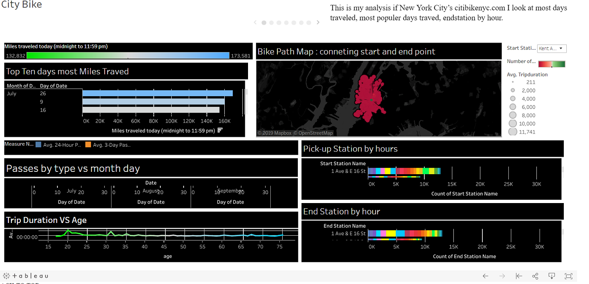

# tableau

I was tasked with useing data from new Yourk Citi Bike Program : https://en.wikipedia.org/wiki/Citi_Bike

there API they have CSV files for down load : https://www.citibikenyc.com/system-data
 
 I download Ride data from the month of july , Augist , September 
 the ride data was broken down in a CSV file : 
 
 Trip Duration (seconds)
 
Start Time and Date

Stop Time and Date

Start Station Name

End Station Name

Station ID

Station Lat/Long

Bike ID

User Type (Customer = 24-hour pass or 3-day pass user; Subscriber = Annual Member)

Gender (Zero=unknown; 1=male; 2=female)

Year of Birth

I loaded the CSV file. and my First chart was I created : was a map useing Lat and Long for both start points and end points on a map so when an address is picked it till connet to all posable end points that were were done. 

Bar graph on most ten days traveled
most passes tipe vs month
Tip Duration vs age: 
used only tableau no python at all . 

